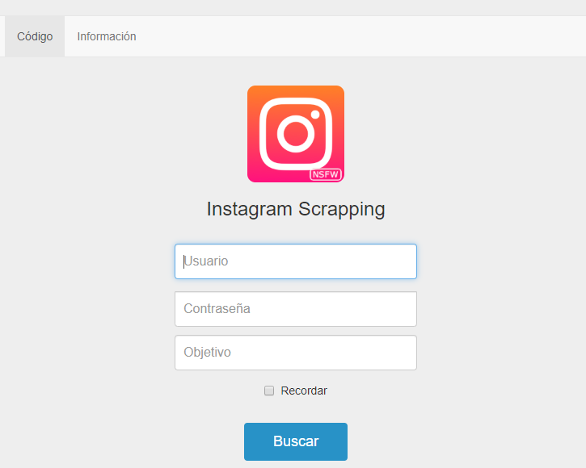
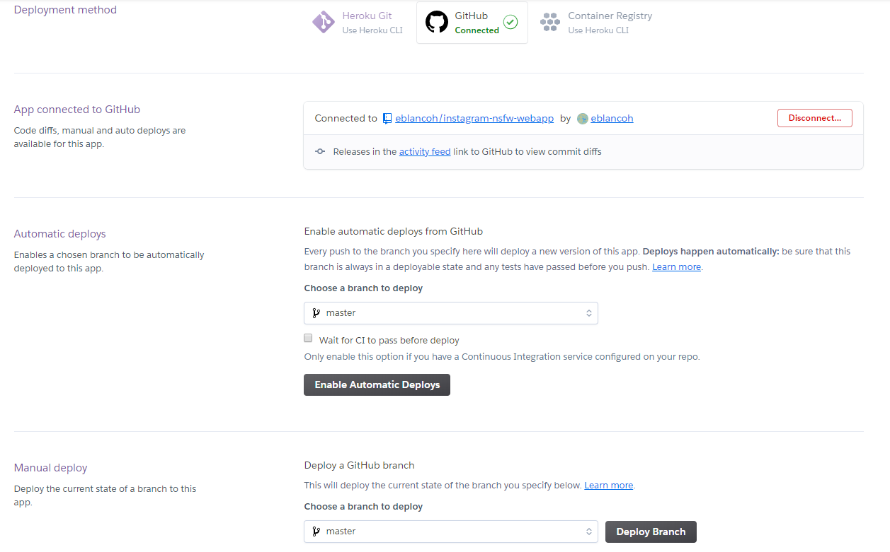

# Instagram NSFW Webapp

Este proyecto toma como bases las rutinas generadas bajo el proyecto [Instagram Scrapping: contribución **Departamento de Ideas Locas** Telefónica CDO](https://github.com/eblancoh/instagram-nsfw). Ver enlace para más detalles sobre esta primera PoC.

Haciendo uso del motor dessrrollado en la Prueba de Concepto anteriormente desarrollada, se ha creado una **Aplicación Web** sencilla usando [**Python Flask**](https://palletsprojects.com/p/flask/) y [**Bootstrap 3**](https://getbootstrap.com/docs/3.3/).

Para descragar este repositorio, simplemente ejecutar en consola:
```bash
$ git clone https://github.com/eblancoh/instagram-nsfw-webapp.git
```

Resumen de uso
------------
En esta PoC se hace uso tanto de los siguientes WebDrivers para poder hacer el scrapping del contenido HTML:
* [ChromeDriver - WebDriver for Chrome](http://chromedriver.chromium.org/) 
* [GeckoDriver - WebDriver for Firefox](https://firefox-source-docs.mozilla.org/testing/geckodriver/)

Hay que incluir en el PATH las rutas en las que los drivers se encuentren. Para **Linux** basta con ejecutar:
```bash
$ export PATH=$PATH:/path/to/driver/chrome-driver
```
```bash
$ export PATH=$PATH:/path/to/driver/gecko-driver
```
Para añadir al PATH en **Windows**, se pueden seguir los [siguientes pasos](https://helpdeskgeek.com/windows-10/add-windows-path-environment-variable/).


### Levantando la página web en local 

```python
python instagram_scrapper/app.py
```
Tras ejecutar este comando se levantará un servidor al que se puede acceder a través de la ruta:

```bash
http://localhost:5000/
```
Esto nos dirige a la página que nos permitirá lanzar el proceso de scraping del perfil privado.

### Lanzando una consulta sobre perfil privado

<div style="text-align:center">

<p>Página de login y comienzo de búsqueda</p>
</div>

**Requisitos**: 
- Tener un perfil de Instagram. Las credenciales a usar se introducen en la página de login.
- El perfil a scrapear debe ser privado (perfil objetivo).

**Se lanza la búsqueda y se dan los siguientes pasos**:
1. Se comprueba que se produce satisfactoriamente el login en Instagram.
2. Se comprueba que el usuario objetivo existe.
3. Se accede al perfil y se comienza a obtener a información en la que estamos interesados a través de Selenium y BeautifulSoup.

Con la información obtenida se hace uso de [Nudity image detection HTTP API](https://github.com/EugenCepoi/nsfw_api). Este proyecto proporciona una API REST lista para implementar que permite predecir si una imagen es ofensiva o tiene contenido para adultos.

Tras esperar a que todo el contenido de interés se haya otenido mediante scrapping, obtendremos otra vista con el nivel de exposición de la cuenta privada, así como un resumen de las scores NSFW de las imágenes obtenidas.

### Levantando la página web en Heroku

[**Heroku**](https://dashboard.heroku.com/apps) es una Plataforma como servicio (PaaS) que nos abstrae de tratar con servidores, todo lo que tenemos que hacer es registrarnos, descargar algunas herramientas y luego cargar nuestro código en la plataforma sin esfuerzo.
#### Instalando un servicio web llamado **gunicorn**

```bash 
$ pip install gunicorn
```
#### Creamos un fichero `requirements.txt`

```bash 
$ pip freeze > requirements.txt
```
El cual ya está incluido en el actual repositorio.

#### Creando un fichero `Procfile`

Debemos crear el fichero `Procfile` sin extensión y con la P mayúscula e incluir lo siguiente:

```bash 
web: gunicorn app:app
```
Aquí Heroku usa la web para iniciar un servidor web para la aplicación; `app:app` indica que el módulo y el nombre de la aplicación en nuestro caso.
Recomendamos hacer un fork del presente repo para posteriormente crear una app en Heroku.

#### Creando y desplegando una app en Heroku desde GitHub

Antes de crear una aplicación, hay que asegurarse de que su cuenta de GitHub esté conectada con la cuenta de Heroku

<div style="text-align:center">

<p>Creando una app en Heroku</p>
</div>
Posteriomente seleccionamos el repositorio de GitHub y elegimos la rama a desplegar.

<div style="text-align:center">

<p>Creando una app en Heroku</p>
</div>

Tras desplegar, deberemos esperar un poco para poder hacer uso del servicio.

#### Haciendo uso de la app

Una vez dezplegada, simplemente debemos ir a la siguiente ruta para comenzar a usarla.
https://instagram-nsfw-webapp.herokuapp.com/

Licencia
-------
This is free and unencumbered software released into the public domain.

Anyone is free to copy, modify, publish, use, compile, sell, or
distribute this software, either in source code form or as a compiled
binary, for any purpose, commercial or non-commercial, and by any
means.

In jurisdictions that recognize copyright laws, the author or authors
of this software dedicate any and all copyright interest in the
software to the public domain. We make this dedication for the benefit
of the public at large and to the detriment of our heirs and
successors. We intend this dedication to be an overt act of
relinquishment in perpetuity of all present and future rights to this
software under copyright law.

THE SOFTWARE IS PROVIDED "AS IS", WITHOUT WARRANTY OF ANY KIND,
EXPRESS OR IMPLIED, INCLUDING BUT NOT LIMITED TO THE WARRANTIES OF
MERCHANTABILITY, FITNESS FOR A PARTICULAR PURPOSE AND NONINFRINGEMENT.
IN NO EVENT SHALL THE AUTHORS BE LIABLE FOR ANY CLAIM, DAMAGES OR
OTHER LIABILITY, WHETHER IN AN ACTION OF CONTRACT, TORT OR OTHERWISE,
ARISING FROM, OUT OF OR IN CONNECTION WITH THE SOFTWARE OR THE USE OR
OTHER DEALINGS IN THE SOFTWARE.
________________________________________


